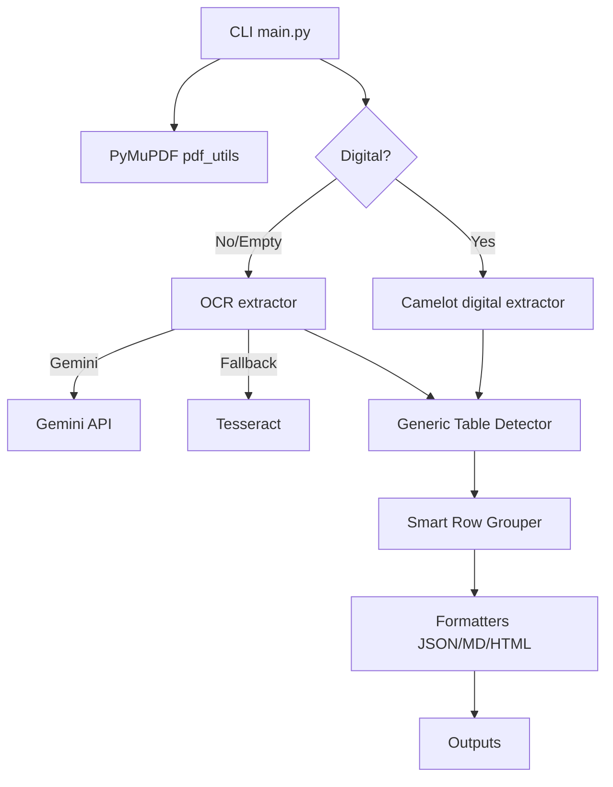

## Generic PDF Table Extraction

Modular Python tool to extract table contents from any PDF document (digital and scanned) and output them as JSON and Markdown, with optional HTML rendering. Supports multi-page tables and batch processing via CLI.

### Objective
Develop a Python solution to extract table contents from specified pages of financial statement PDFs and output them in JSON/Markdown format, with extensibility for multi-page, multi-document processing.

### Features
- **Generic table detection** - Works with any document type (invoices, reports, financial statements, etc.)
- **Digital PDFs** with Camelot for structured tables
- **Scanned PDFs** using Gemini OCR (env `GEMINI_API_KEY`), with Tesseract fallback
- **Automatic structure detection** - No hardcoded patterns or document-specific logic
- **Smart row grouping** - Automatically detects related rows and groups them intelligently
- **Outputs**: JSON, Markdown, optional HTML
- **PyMuPDF** for text and metadata
- **CLI** with Click and parallel extraction via joblib

### Scope
- Accept PDFs (digital or scanned) and user-specified page numbers
- Extract tables and their metadata (title, headers, rows)
- Generate JSON/Markdown outputs, optional HTML rendering
- Support batch processing across multiple documents
- Handle edge cases: multi-page tables, invalid inputs

### Architecture



### How It Works

1. **Automatic Table Detection**: Analyzes PDF content to identify structured tables without relying on specific document types
2. **Header Recognition**: Intelligently finds header rows based on content patterns and structure
3. **Smart Row Grouping**: Automatically groups related rows (main data + continuation/supplementary rows)
4. **Content Analysis**: Detects data types (numbers, codes, text, metadata) to understand relationships
5. **Flexible Output**: Generates clean, structured output for any table type

### Reference Tools & Rationale
- **Camelot** reliably parses lattice/stream tables in digital PDFs
- **Gemini OCR** improves accuracy on scanned tables (structure + text), with Tesseract as backup
- **PyMuPDF** is fast for metadata and per-page handling
- **Generic approach** ensures the system works with any document type
- **Pandas and tabulate** are standard for structuring and Markdown rendering
- **Click** provides a clean CLI; joblib enables parallel batch runs

### Security
- No credentials or PII are hardcoded
- Environment variables for API keys (e.g., `GEMINI_API_KEY`)
- Add a `.gitignore` to exclude `.venv/`, outputs, and local configs

### Setup
1. **Clone the repository**:
```bash
git clone https://github.com/dhanya807/table-extractor.git
cd /directory
```
2. Python 3.10+
3. Install system deps: Ghostscript and Tkinter may be required for Camelot; Tesseract for fallback OCR.
4. Install Python deps:
```bash
python -m venv .venv
. .venv/Scripts/activate  # Windows PowerShell: .venv\Scripts\Activate.ps1
pip install -r requirements.txt
```
    Note: If your Python version does not meet some of the package requirements, certain dependencies (e.g., click, PyMuPDF, camelot) may not install automatically. In that case, please install them manually using the following commands in your terminal:
    ```bash
    pip install PyMuPDF camelot-py click joblib pandas
    ```


5. Set Gemini API key (for scanned PDFs):
```bash
$env:GEMINI_API_KEY = "<your_key>"
```

### Usage
```bash
python main.py --files Document1.pdf Document2.pdf --pages 2,3 --output-format json,md
```

Outputs per input PDF will be saved to `outputs/<basename>.<json|md|html>`.

### What It Can Handle

- **Financial Documents**: Invoices, balance sheets, income statements
- **Reports**: Research papers, technical documentation, data tables
- **Forms**: Application forms, surveys, questionnaires
- **Any Structured Data**: Tables, lists, matrices with consistent column structure

### Build & Test
- Run extraction using the CLI above
- Outputs per input PDF will be saved to `outputs/<basename>.<json|md|html>`
- (Optional) Add tests under `tests/` for extractors and formatters

### License
Apache 2.0. See `LICENSE`.

